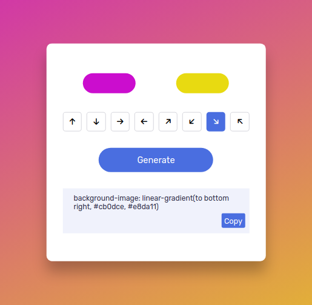

# Gradient Generator

### Step 1 : Pick color - a
### Step 2 : Pick color - b
### Step 3 : Select Direction as desired
### Step 4 : Click on Generate Button
### Step 5 : Click copy button in textarea to copy gradient code
### Step 6 : Paste copied code in css file

## Output -

